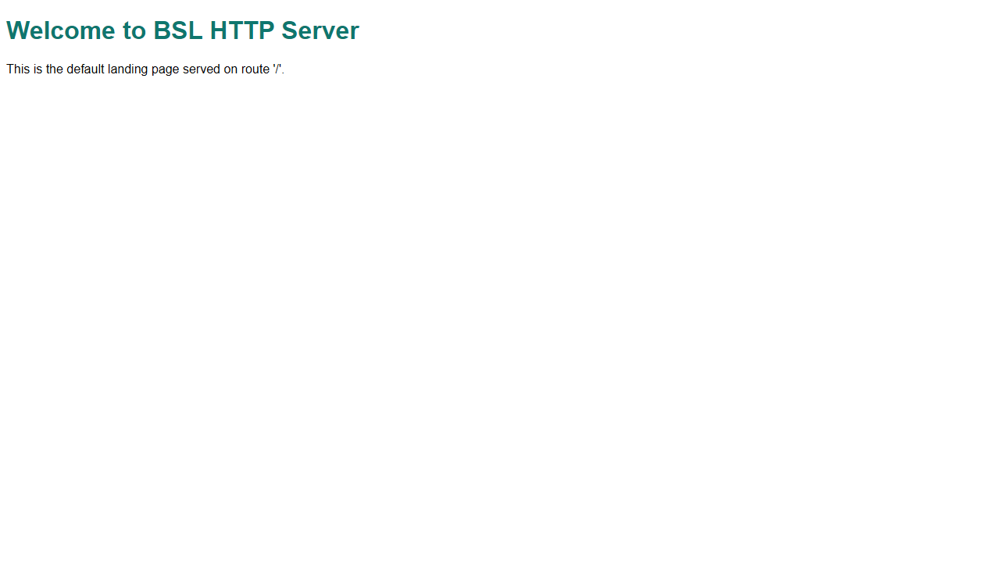
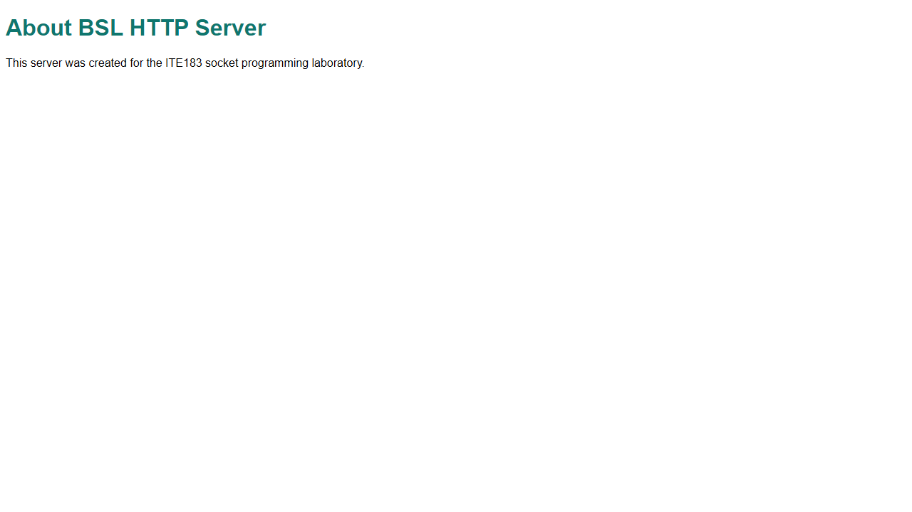
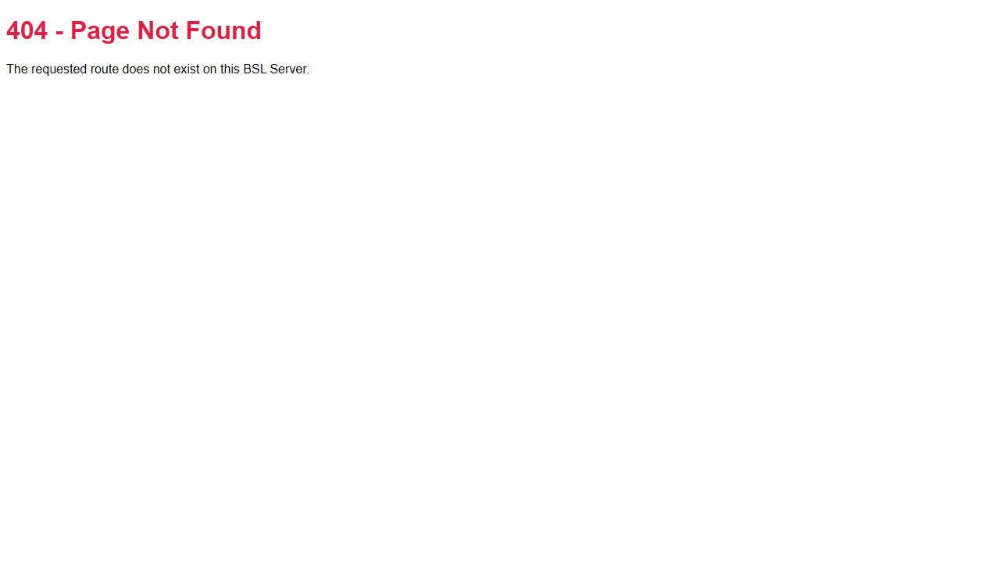
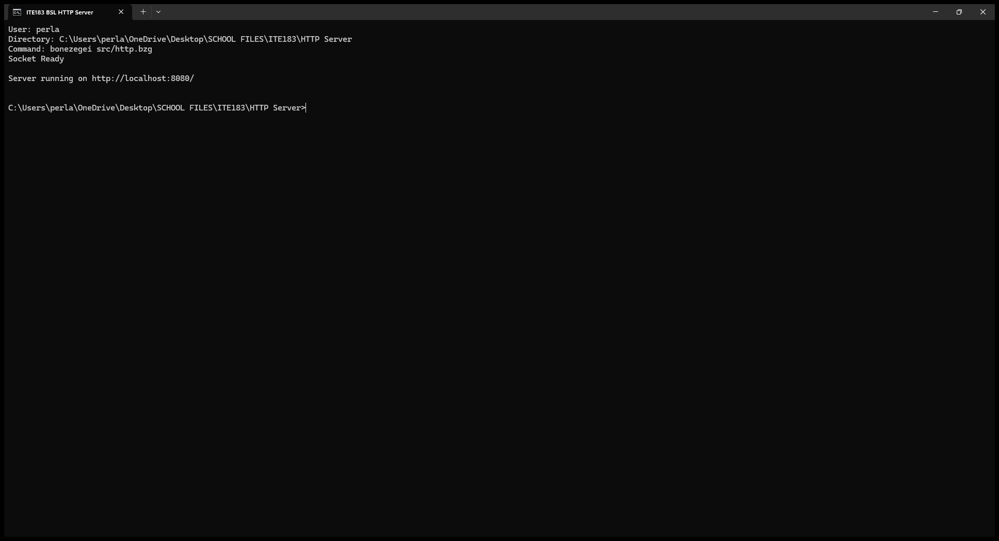

# BSL HTTP Server

A low-level HTTP web server built with the Bonezegei Scripting Language (BSL) and its socket library. This ITE183 laboratory project demonstrates socket initialization, TCP connection handling, basic HTTP responses, and custom routing without using a web framework.

The server listens on port `8080` and provides a home page, an about page, and a custom response for unknown routes.

## Prerequisites

- [Visual Studio Code](https://code.visualstudio.com/)
- Bonezegei Scripting Language Formatter extension for VS Code
- Bonezegei interpreter (follow the installation guide included with the extension)
- Git

Windows and Linux users can install the interpreter natively. macOS and Android users should use GitHub Codespaces and follow the Linux setup instructions.

## Installation and setup

1. Clone this repository and enter its directory:

   ```bash
   git clone https://github.com/PerLanDo/my-bsl-http-server.git
   cd my-bsl-http-server
   ```

2. Install the BSL socket library from the project root:

   ```bash
   bzg install socket
   ```

   This creates the local `lib/socket.bzg` dependency used by the server.

3. Run the server from the project root on Windows:

   ```powershell
   bonezegei src/http.bzg
   ```

4. Wait for the terminal to display:

   ```text
   Socket Ready
   Server running on http://localhost:8080/
   ```

5. Press `Ctrl+C` in the terminal when you want to stop the server.

## Usage

With the server running, open these URLs in a web browser:

| Route | URL | Expected response |
| --- | --- | --- |
| Home | <http://localhost:8080/> | `200 OK` welcome page |
| About | <http://localhost:8080/about> | `200 OK` project information page |
| Unknown | <http://localhost:8080/anything> | `404 Not Found` custom error page |

## Project structure

```text
my-bsl-http-server/
├── .gitattributes
├── LICENSE
├── README.md
├── src/
│   └── http.bzg
└── documentation/
    ├── home.png
    ├── about.png
    ├── 404.png
    └── terminal.png
```

The generated `lib/` directory is installed locally with `bzg install socket` and is not part of the submitted source structure.

## Screenshots

### Home route (`/`)



### About route (`/about`)



### Unknown route (`/anything`)



### Server terminal



## License

This project is available under the [MIT License](LICENSE).
